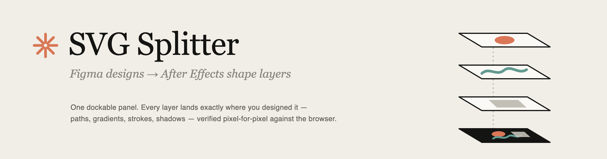

<p align="center">
  
</p>

<p align="center">
  <em>Export a frame from Figma. Get your layers back in After Effects — named, positioned, editable.</em>
</p>

<br/>

After Effects has never had a good answer for SVG. Files import rasterized or as a single flattened
layer, and every workaround routes through Illustrator. **SVG Splitter** is a dockable ScriptUI
panel that reads a Figma-exported SVG directly and rebuilds it as native AE **shape layers** — one
layer per Figma layer, every anchor point centered, every element exactly where you designed it.

It is verified the honest way: an automated suite drives a real After Effects instance over a
battery of Figma-style SVGs, renders each converted comp, and pixel-compares the frame against
headless Chrome rendering the original file. Most fixtures — including a real 3840×2160 Figma
slide — match at **0.00% difference**.

<br/>

## Install

1. Grab [`dist/SVG Splitter.jsx`](dist/SVG%20Splitter.jsx) (or build it yourself — see Development).
2. Copy it into After Effects' ScriptUI Panels folder:

   | Platform | Path |
   |---|---|
   | macOS | `/Applications/Adobe After Effects 2026/Scripts/ScriptUI Panels/` |
   | Windows | `C:\Program Files\Adobe\Adobe After Effects 2026\Support Files\Scripts\ScriptUI Panels\` |

3. Restart AE. The panel appears under **Window → SVG Splitter.jsx** and docks like any native panel.

> **For gradients:** enable *Preferences → Scripting & Expressions → Allow Scripts to Write Files
> and Access Network*. Gradient color stops aren't scriptable in AE, so the panel injects them
> through a temporary animation preset — the panel will remind you if the preference is off.

## Exporting from Figma

- Turn **"Include id attribute" on** in the SVG export options — that's what carries your layer
  names and grouping into AE. Without it the import still works, but layers arrive as anonymous
  `path 1`, `path 2`, …
- Leave **"Simplify stroke"** on (default). Inside/outside strokes arrive as correct center strokes.
- **"Outline text"** is your choice: on (default) imports text as shapes; off creates real,
  editable AE text layers with best-effort font matching.

## Usage

1. **Choose SVG…** and pick your export.
2. Pick a split mode:
   - **One layer per top-level group** — mirrors your Figma layer list. Sub-shapes stay grouped
     inside each layer. *(default)*
   - **One precomp per group** — preserves your Figma hierarchy: every group becomes a
     precomposition, nested groups become nested precomps, and each shape is its own layer
     inside. Group opacity, blend mode, and effects land on the precomp layer.
   - **One layer per shape** — fully exploded; every path becomes its own layer, named by its
     place in the hierarchy.
3. **Create Layers.** A comp sized to the SVG is created (or layers land in your active comp),
   and anything that couldn't convert 1:1 is listed in the log at the bottom of the panel.

## What converts

| SVG | After Effects |
|---|---|
| `path` — all commands, arcs, compound paths with holes | Shape paths, multi-contour, correct fill rule |
| `rect` / `circle` / `ellipse` / `line` / `polyline` / `polygon` | Shape paths |
| Nested transforms, `rotate(a cx cy)`, `matrix(…)` flips | Baked into geometry — pixel-exact |
| Fills, `fill-opacity`, `fill-rule="evenodd"` | Fill with Even-Odd winding |
| Strokes: width, caps, joins, miter, dash arrays, offset | Stroke (AE caps dashes at 3 pairs) |
| Linear & radial gradients, per-stop alpha, `gradientTransform` | Gradient Fill / Stroke with real color stops |
| Element & group `opacity` | Flattened into fill/stroke opacity |
| `mix-blend-mode` | Layer blending mode |
| Figma drop shadow filters (incl. multi-shadow) | Native **Drop Shadow** effect |
| Figma layer blur filters | Native **Gaussian Blur** effect |
| `clipPath` (frame clips, compound clips) | Ignored when canvas-sized; otherwise Merge Paths ∩ |
| Live `<text>` (Outline text off) | AE text layers, baseline-aligned |
| `<use>` / `defs` references | Resolved inline |

**Warned & skipped in v1:** masks (content imports unmasked), inner shadows, background blur,
image/pattern fills (gray placeholder), angular gradients (Figma exports those incorrectly anyway).

## How it's verified

```
npm run e2e
```

The end-to-end suite launches After Effects, runs the converter over every fixture in
`test/fixtures/`, exports a rendered frame, renders the same SVG in headless Chrome, and
pixel-diffs the two:

```
pass   clip-compound.svg     0.00%      pass   kitchen-sink.svg     0.01%
pass   clip-nested.svg       0.00%      pass   primitives.svg       0.00%
pass   flat-no-ids.svg       0.00%      pass   strokes-dashes.svg   0.00%
pass   gradients.svg         0.00%      pass   shadow-blur.svg      1.07%
pass   groups-transforms.svg 0.00%      pass   opacity-blend.svg    5.90%
pass   icons-holes.svg       0.00%      pass   use-defs.svg         0.00%
```

The two non-zero results are antialiasing falloff on blurs and the documented group-opacity
flattening divergence. Drop your own problematic export into `test/fixtures/` and the harness
will tell you exactly which pixels disagree, with side-by-side artifacts in `test/e2e/out/`.

There are also **237 unit tests** (`npm test`) over the parsing/geometry core, which is plain
dependency-free ES3 JavaScript that runs identically in Node and ExtendScript.

## Development

```
npm install
npm test          # unit tests (Node)
node build.js     # ES3 lint gate + bundle → dist/SVG Splitter.jsx
npm run e2e       # full AE ↔ Chrome pixel verification (macOS, AE 2026)
```

Layout: `src/core/` is the SVG pipeline (XML parser, path/arc math, transforms, style cascade,
scene builder) — pure ES3, shared verbatim between Node tests and the AE runtime. `src/ae/` is
the ExtendScript side (shape builder, gradient injection, ScriptUI panel). `build.js`
concatenates everything into the single distributable file.

### The gradient trick

AE's `ADBE Vector Grad Colors` property has been unscriptable since 2007. This tool writes the
stops anyway: a canonical AE-2026-authored preset ([`tools/probe-canonical.ffx`](tools/probe-canonical.ffx))
is used as a container, the `Gradient Color Data` XML inside its RIFX `Utf8` chunk is regenerated
for the actual stops, ancestor chunk sizes are patched by the length delta, and the preset is
applied with the target property selected. The classic AEUX-era template approach silently
corrupts colors on modern AE — its stale RIFX sizes make AE truncate the XML mid-parse — which
this repo diagnoses and fixes; the full story is in [`src/ae/gradients.jsx`](src/ae/gradients.jsx).
To regenerate the container for a future AE version: save any shape-layer Gradient Fill as an
animation preset, then `node tools/gen-grad-template.js path/to/preset.ffx`.

## Credits

Gradient stop injection builds on the technique from
[Google AEUX](https://github.com/google/AEUX) (Apache-2.0). Everything else was written for this
project — with a very large assist from an automated verification loop that rendered every change
inside a real copy of After Effects.
